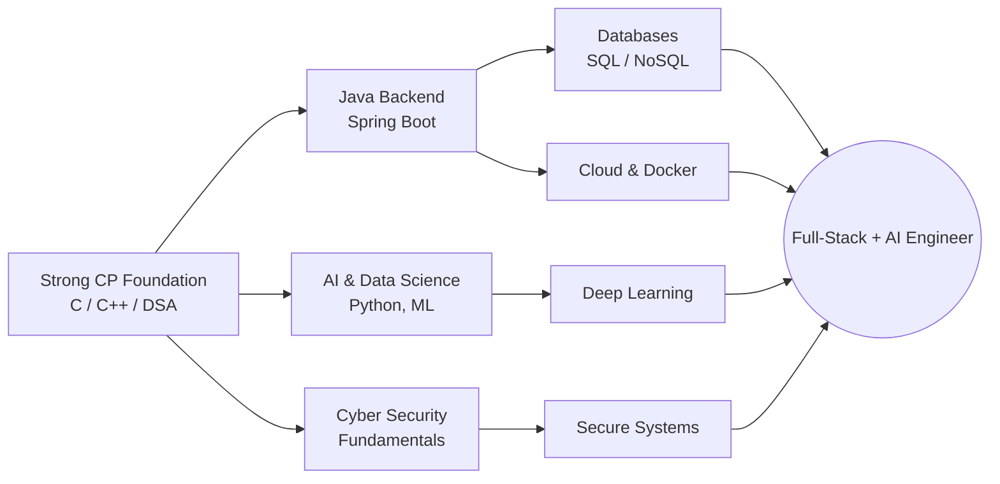

<!-- ====================== HERO ====================== -->
<div align="center">


<a href="https://git.io/typing-svg">
  
</a>

<p>
  
  
  
</p>

</div>

---

<!-- ====================== ABOUT ====================== -->
### 🧭 About Me

```yaml
Name:        Srijansil Khamrai
Role:        CS Undergraduate & Competitive Programmer
College:     Indian Institute of Information Technology, Allahabad
Program:     B.Tech in Information Technology (Class of 2029)
Strengths:   [algorithmic problem-solving, logic building, C/C++]
Learning:    [Java backend, AI & Data Science, Cyber Security, Cloud, Databases]
Mindset:     "Reduce every hard problem to a smaller solved one."
```

I'm a first-year IT undergraduate at **IIIT Allahabad** who treats programming as a
thinking discipline first and a tool second. My core strength is **competitive
programming** — turning ambiguous problems into precise, efficient algorithms under
time pressure. I'm now channeling that problem-solving foundation into building real
systems: **backend engineering in Java**, **AI & data science**, and **cyber security**.

**Long-term vision:** engineer systems that are correct, efficient, and secure — and
eventually work at the intersection of applied AI and systems.

---

<!-- ====================== HIGHLIGHTS ====================== -->
### ⚡ Quick Highlights

| 🏆 Competitive Programming | 🎓 Education | 🧠 Focus | 🌱 Currently Learning |
|:---:|:---:|:---:|:---:|
| Active on 5+ CP platforms | IIIT Allahabad, IT | Algorithms & Logic | Java Backend, AI/ML, Security |

---

<!-- ====================== TECH STACK ====================== -->
### 🛠️ Tech Stack

**Languages (comfortable)**

<p>
  
</p>

**Learning / Exploring**

<p>
  
</p>

> 🔎 *Honest labeling: languages above are ones I actively write. The second row
> reflects technologies I'm currently learning, not yet claiming expertise in.*

---

<!-- ====================== SKILL RADAR ====================== -->
### 📊 Skill Snapshot

| Tier | Technologies |
|:---|:---|
| **🟢 Strong** | C, C++, Algorithms & Data Structures, Problem Solving |
| **🟡 Proficient** | Python, Java (fundamentals) |
| **🟠 Learning** | Spring / Backend, Databases (SQL & NoSQL), AI/ML, Cyber Security |
| **🔵 Exploring** | Cloud (AWS), Docker, Data Science tooling |

---

<!-- ====================== PHILOSOPHY ====================== -->
### 🧩 Engineering Philosophy

- **Correctness before cleverness** — a working brute force beats a broken optimization.
- **Reduce, don't reinvent** — most hard problems are a known problem in disguise.
- **Complexity is a budget** — know your time/space bounds before you type.
- **Learn in public** — every contest and bug is a logged lesson.

---

<!-- ====================== COMPETITIVE PROGRAMMING ====================== -->
### 🏆 Competitive Programming

<div align="center">

<!-- Codeforces -->


<!-- LeetCode -->

</div>

**Profiles**

<p>
  <a href="https://codeforces.com/profile/Srijansil2006"></a>
  <a href="https://www.codechef.com/users/srijansil2006"></a>
  <a href="https://leetcode.com/u/Srijansil/"></a>
  <a href="https://atcoder.jp/users/Srijansil2006"></a>
  <a href="https://projecteuler.net/progress=Srijansil2006"></a>
</p>

> ⚠️ **Verify before publishing:** LeetCode and AtCoder URLs use handle-based paths.
> Confirm your exact LeetCode username slug from your profile URL (it may differ from
> your display name "Srijansil Khamrai") and update both the badge and the leetcard link.

---

<!-- ====================== GITHUB STATS ====================== -->
### 📈 GitHub Statistics

<div align="center">


</div>

<!-- Snake animation (generated by the GitHub Action in this repo) -->
<div align="center">


</div>

---

<!-- ====================== ROADMAP ====================== -->
### 🗺️ Current Learning Roadmap



**Now:** Java backend fundamentals · SQL databases · ML basics
**Next:** Spring Boot · Docker · one end-to-end project (backend + DB)
**Later:** Cloud deployment (AWS) · applied deep learning

---

<!-- ====================== PROJECTS (placeholder, honest) ====================== -->
### 🚧 Featured Projects

> **To be filled.** No public projects yet — I'm currently building my first
> end-to-end project (a Java backend service). This section will be updated with
> problem statement, architecture, tech stack, and a live demo once it ships.

<!--
TEMPLATE — duplicate per project when ready:

#### 🔹 Project Name
> One-line problem statement.
- **Stack:** ...
- **Highlight:** hardest technical challenge you solved
- **Repo:** ... · **Demo:** ...
-->

---

<!-- ====================== CONTACT ====================== -->
### 📫 Connect

<p>
  <a href="https://www.linkedin.com/in/srijansil-khamrai-07a04927a"></a>
  <a href="mailto:srijankhamrai2006@gmail.com"></a>
  <a href="https://github.com/srijansil2006"></a>
</p>

---

<div align="center">

<sub>⚡ "Reduce every hard problem to a smaller solved one." · Built with honesty — no fake metrics.</sub>


</div>
